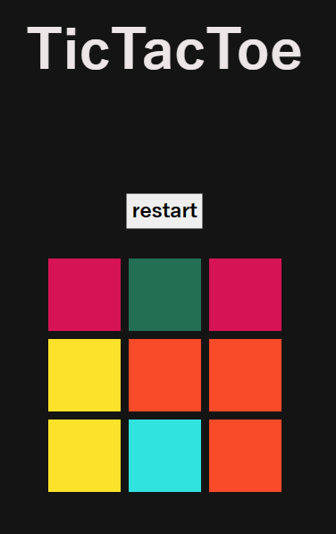
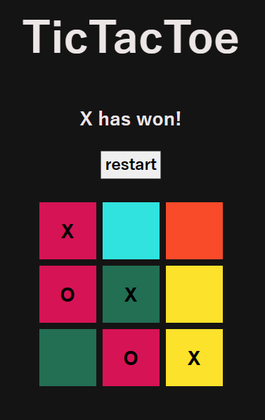

# TicTacToe

simple TicTacToe game using JavaScript.
 

I made this project to get more into javascript again and also for practice.
I also did some "questionable" things in the code, for example creating a class which isn't really needed, but I just wanted to get familiar with the syntax.

Features:

- functional game
- restart button
- winner display
- rainbow board

## Preview Images

